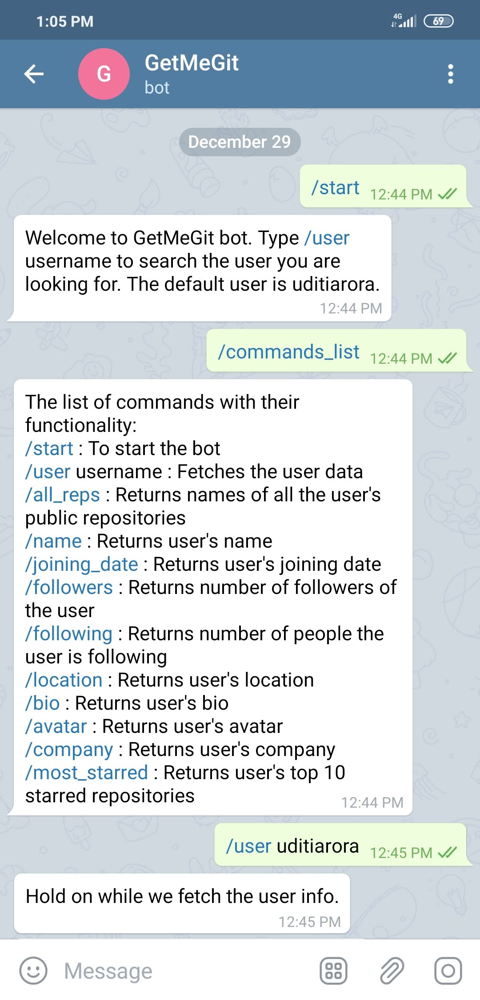
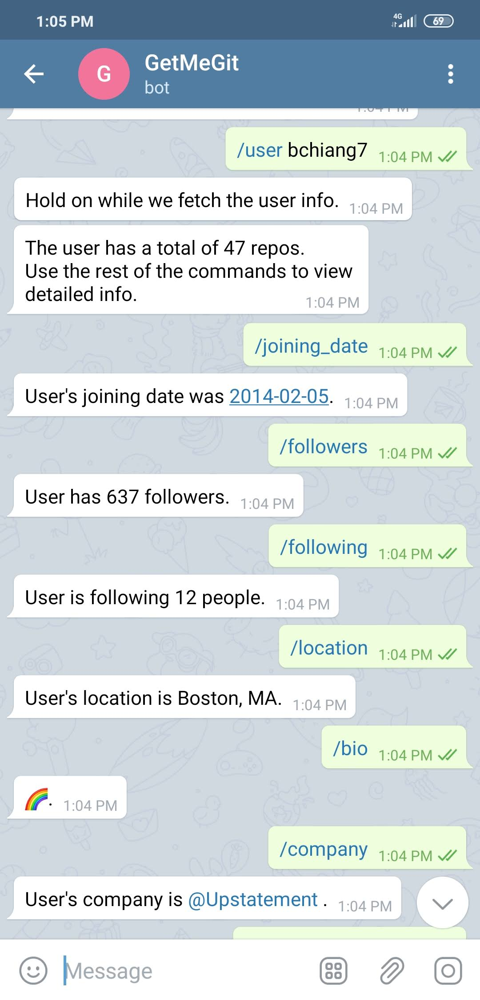
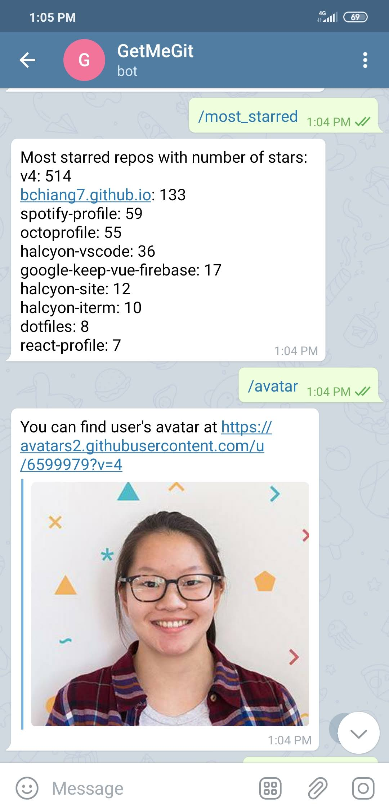
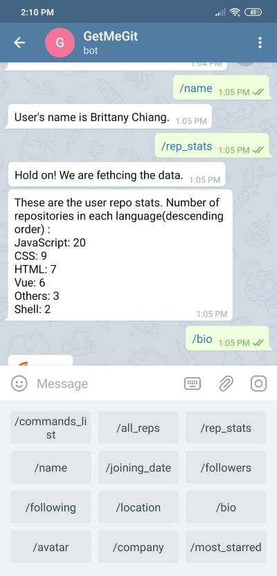

# GetMeGit
Telegram bot to fetch public user data from github.

## Hosting Locally
1. Clone the repo.

2. Run :
```bash
npm install
```
3. Run :
```bash
node index
```
4. Go to localhost:3000 in your browser.

#### The bot uses :
1. Github API
2. [GitHub Polyglot](https://github.com/IonicaBizau/node-gh-polyglot)

## Screenshots 






Note: The bot is not available on Telegram it has not been deployed on any server. Anyone can host this locally. Make sure to use your own telegram token.
